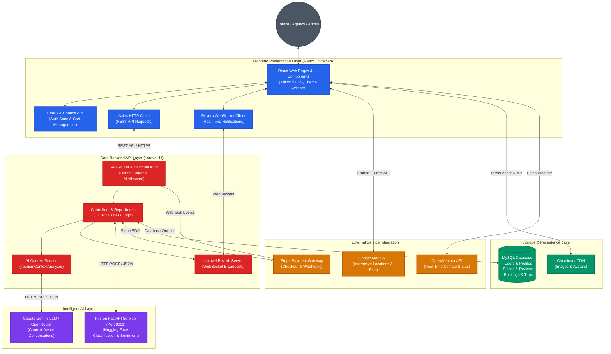

# Smart Tourism & Intelligent Travel Management System

A comprehensive, full-stack web application for intelligent travel and tourism management featuring real-time notifications, AI-powered recommendations, and seamless booking management.

## 🚀 Project Overview

This project is a modern tourism management system that combines:
- **Frontend**: React + Vite for a responsive, fast user interface
- **Backend**: Laravel for robust API and business logic
- **AI Service**: Python-based service for intelligent recommendations and insights

### Key Features
- User authentication and account management
- Destination browsing and exploration
- Hotel and package booking
- Payment integration (Stripe)
- Real-time notifications and chat assistance
- Theme switching (Dark/Light mode)
- Responsive design with Tailwind CSS
- AI-powered chat assistant

## 🏛️ System Architecture

The Smart Tourism system is structured as a modern distributed three-tier architecture with dedicated presentation, business logic, intelligence, and integration layers.

### Architectural Diagram



### Component Details
1. **Frontend Presentation Layer (React + Vite)**: Communicates with Laravel backend endpoints. Real-time updates and push alerts are powered by Laravel Reverb WebSockets.
2. **Core Backend Layer (Laravel 11)**: Central rest API provider executing controllers, repositories, event listeners, and Stripe SDK payment processes. It manages database migrations and serves Sanctum-based API tokens.
3. **AI Services Layer (Google Gemini / OpenRouter / Python FastAPI)**:
   - Direct APIs interact with Google Gemini or OpenRouter endpoints to power the conversational guide, utilizing database message threads and context extraction.
   - An independent FastAPI service (port `8001`) calls Hugging Face models for classification (e.g., zero-shot crowd assessment), review sentiment, and recommendations.
4. **External Services Gateways**: Seamlessly integrates with Stripe checkout, OpenWeather API for localized destination climate status, and Google Maps API for interactive routes and geocoordinates.
5. **Persistence Layer**: An ACID-compliant MySQL database storing relational tables for users, places, itineraries, and bookings.

## 📁 Project Structure

```
.
├── client/                 # React + Vite frontend application
│   ├── src/
│   │   ├── components/    # Reusable UI components
│   │   ├── pages/         # Page components
│   │   ├── services/      # API services
│   │   ├── hooks/         # Custom React hooks
│   │   ├── context/       # Context API for state management
│   │   └── redux/         # Redux state management
│   ├── package.json
│   ├── vite.config.js
│   └── tailwind.config.js
│
├── server/                 # Laravel backend API
│   ├── app/
│   │   ├── Http/         # Controllers and middleware
│   │   ├── Models/       # Eloquent models
│   │   ├── Services/     # Business logic
│   │   ├── Events/       # Application events
│   │   └── Repositories/ # Data access layer
│   ├── routes/
│   │   ├── api.php       # API routes
│   │   └── web.php       # Web routes
│   ├── database/
│   │   ├── migrations/   # Database schema
│   │   └── seeders/      # Database seeders
│   ├── config/           # Configuration files
│   ├── composer.json
│   └── artisan           # Laravel CLI
│
├── ai_service/            # Python AI service
│   ├── main.py
│   ├── requirements.txt
│   └── ...
│
├── API_KEYS_SETUP.md      # API configuration guide
├── CONTEXT_AWARE_AI_GUIDE.md  # AI context guidelines
├── Software_Requirements_Specification.md  # Project SRS
└── README.md              # This file
```

## 🛠️ Technology Stack

### Frontend
- **React** - UI library
- **Vite** - Build tool and dev server
- **Tailwind CSS** - Utility-first CSS framework
- **Redux** - State management
- **React Router** - Client-side routing
- **Axios** - HTTP client

### Backend
- **Laravel** - PHP web framework
- **PHP 8+** - Server-side language
- **MySQL/PostgreSQL** - Database
- **Laravel Sanctum** - API authentication
- **Laravel Broadcasting** - Real-time features
- **Stripe** - Payment processing

### AI Service
- **Python** - AI/ML language
- **Flask/FastAPI** - Web framework
- **TensorFlow/PyTorch** - Machine learning

## 📦 Installation & Setup

### Prerequisites
- **Node.js** (v16+) and npm for frontend
- **PHP** (v8+) and Composer for backend
- **Python** (v3.8+) for AI service
- **MySQL** or PostgreSQL database
- **Git** for version control

### Frontend Setup (Client)

```bash
cd client
npm install
npm run dev      # Start development server
npm run build    # Build for production
npm run lint     # Run ESLint
```

### Backend Setup (Server)

```bash
cd server
composer install
cp .env.example .env
php artisan key:generate
php artisan migrate              # Run database migrations
php artisan serve               # Start development server
php artisan db:seed             # Seed the database (optional)
```

### AI Service Setup

```bash
cd ai_service
python -m venv venv
source venv/bin/activate        # On Windows: venv\Scripts\activate
pip install -r requirements.txt
python main.py
```

## 📋 Environment Configuration

### Frontend (.env)
```
VITE_API_URL=http://localhost:8000
```

### Backend (.env)
```
APP_NAME="Smart Tourism"
APP_URL=http://localhost:8000
DB_CONNECTION=mysql
DB_HOST=127.0.0.1
DB_PORT=3306
DB_DATABASE=tourism_db
DB_USERNAME=root
DB_PASSWORD=

STRIPE_PUBLIC_KEY=your_stripe_public_key
STRIPE_SECRET_KEY=your_stripe_secret_key

# Broadcasting
BROADCAST_DRIVER=pusher
PUSHER_APP_ID=your_pusher_app_id
PUSHER_APP_KEY=your_pusher_app_key
PUSHER_APP_SECRET=your_pusher_app_secret
```

Refer to [API_KEYS_SETUP.md](API_KEYS_SETUP.md) for detailed API configuration instructions.

## 🚀 Running the Project

### Development

Open multiple terminals and run:

1. **Frontend** (Terminal 1)
```bash
cd client
npm run dev
```

2. **Backend** (Terminal 2)
```bash
cd server
php artisan serve
```

3. **AI Service** (Terminal 3)
```bash
cd ai_service
python main.py
```

Access the application at `http://localhost:5173` (frontend)

### Production Build

```bash
# Frontend
cd client
npm run build

# Backend - Deploy using Laravel deployment best practices
cd server
# Follow Laravel production deployment guidelines
```

## 📚 Documentation

- [Software Requirements Specification](Software_Requirements_Specification.md) - Detailed project requirements and specifications
- [API Keys Setup Guide](API_KEYS_SETUP.md) - Configure external services and API keys
- [Context-Aware AI Guide](CONTEXT_AWARE_AI_GUIDE.md) - AI service integration and usage
- [Client README](client/README.md) - Frontend-specific documentation
- [Server README](server/README.md) - Backend-specific documentation

## 🔐 Security

- Authentication via Laravel Sanctum
- CORS configuration in `server/config/cors.php`
- Password hashing and validation
- SQL injection prevention via Eloquent ORM
- XSS protection with React
- CSRF protection on web routes
- Input validation on both client and server

## 🧪 Testing

### Backend Tests
```bash
cd server
php artisan test
php artisan test:feature  # Feature tests
php artisan test:unit    # Unit tests
```

### Frontend Tests
```bash
cd client
npm run test  # Run tests (if configured)
```

## 📱 Supported Features

- **User Management**: Registration, Login, Password Recovery
- **Destinations**: Browse and explore travel destinations
- **Hotels**: Search and book hotels
- **Packages**: View and book travel packages
- **Payments**: Secure payment processing via Stripe
- **Notifications**: Real-time notifications and alerts
- **Chat Assistant**: AI-powered chat for travel assistance
- **Dark Mode**: Theme switching for better UX
- **Responsive Design**: Works on desktop, tablet, and mobile

## 🤝 Contributing

1. Fork the repository
2. Create a feature branch (`git checkout -b feature/amazing-feature`)
3. Commit changes (`git commit -m 'Add amazing feature'`)
4. Push to branch (`git push origin feature/amazing-feature`)
5. Open a Pull Request

## 📝 License

This project is licensed under the MIT License - see the LICENSE file for details.

## 👥 Team

This project was developed as part of a Software Engineering course (Continuous Assessment 3).

For more information about team members and contributions, see [Software_Requirements_Specification.md](Software_Requirements_Specification.md).

## 📞 Support & Contact

For issues, questions, or suggestions, please:
- Open an issue on the project repository
- Contact the development team through the Contact page in the application

## 🎯 Future Enhancements

- Multi-language support
- Advanced search filters
- User reviews and ratings
- Booking history and analytics
- Mobile app (React Native)
- Advanced AI recommendations
- Social media integration

---

**Last Updated**: May 25, 2026  
**Version**: 1.0.0
