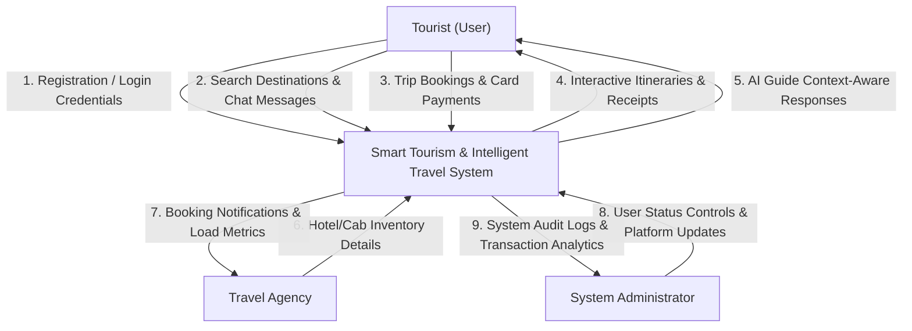
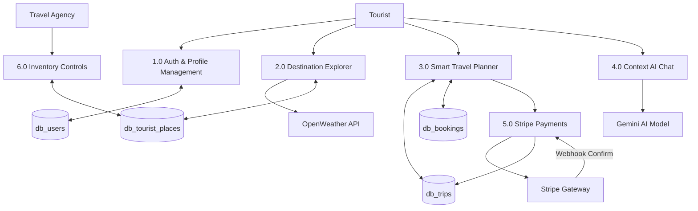
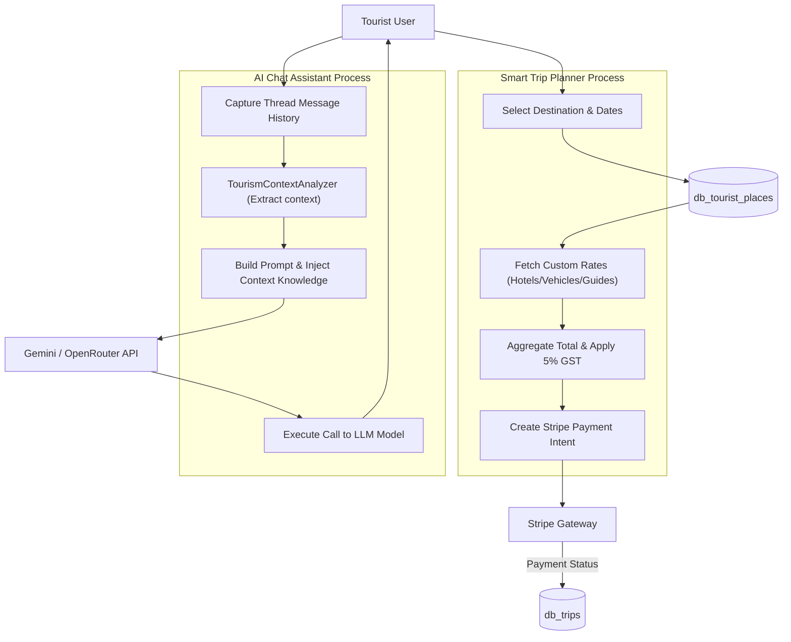
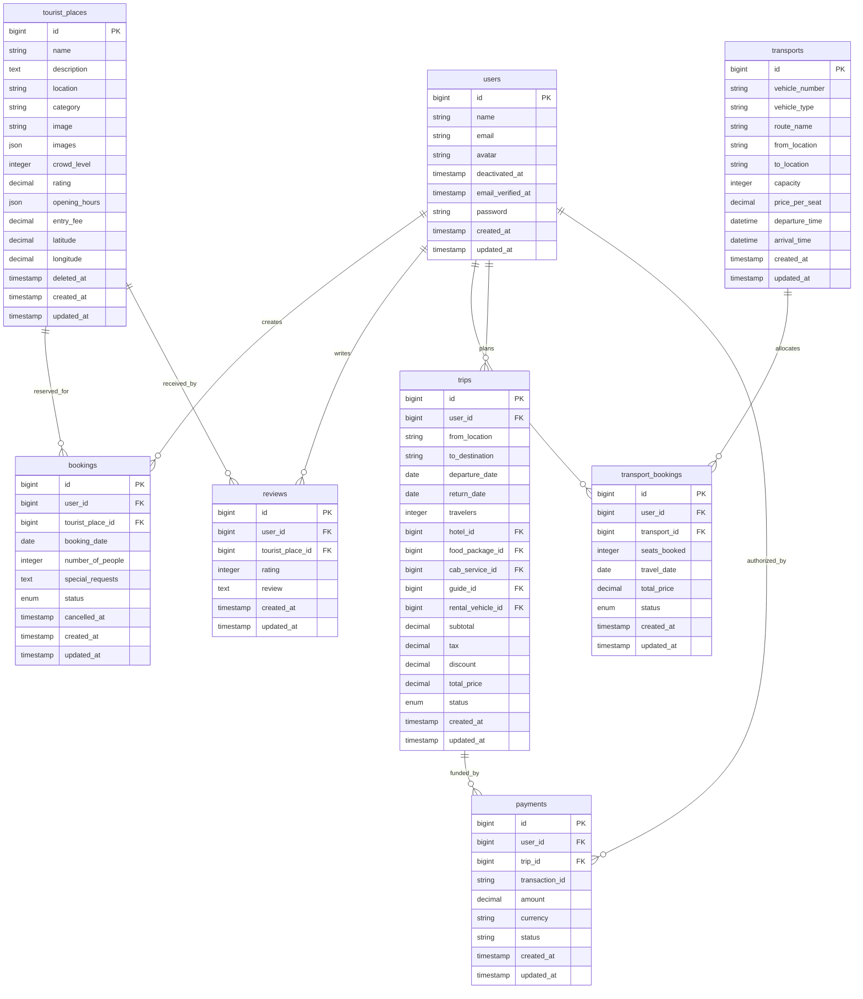

# Software Requirements Specification (SRS)
## Smart Tourism & Intelligent Travel Management System

---

**Course Code:** [Course Code, e.g., CSE401]  
**Course Name:** [Course Name, e.g., Software Engineering & Management]  
**Prepared for:** Continuous Assessment 3 (Spring 2025)

**Student Names:**
* [Student Name 1]
* [Student Name 2]
* [Student Name 3]

**Student Registration Numbers:**
* [Registration Number 1]
* [Registration Number 2]
* [Registration Number 3]

**Prepared for:**  
Continuous Assessment 3  
Spring 2025  

---

## Revision History

| Date | Version | Description | Author |
| :--- | :--- | :--- | :--- |
| 2026-05-13 | 1.0.0 | Initial Database Schemas and Basic Auth API | [Student Name 1] |
| 2026-05-18 | 1.1.0 | Added Transport Booking and Activity Logs Schema | [Student Name 2] |
| 2026-05-19 | 1.2.0 | Integrated Stripe Payments & Smart Planner Modules | [Student Name 3] |
| 2026-05-20 | 2.0.0 | Context-Aware AI Chatbot, Coordinates, and Maps | System Architect |

---

## Table of Contents

* [1. Introduction](#1-introduction)
  * [1.1 Purpose](#11-purpose)
  * [1.2 Scope](#12-scope)
  * [1.3 Definitions, Acronyms, and Abbreviations](#13-definitions-acronyms-and-abbreviations)
  * [1.4 References](#14-references)
  * [1.5 Overview](#15-overview)
* [2. General Description](#2-general-description)
  * [2.1 Product Perspective](#21-product-perspective)
  * [2.2 Product Functions](#22-product-functions)
  * [2.3 User Characteristics](#23-user-characteristics)
  * [2.4 General Constraints](#24-general-constraints)
  * [2.5 Assumptions and Dependencies](#25-assumptions-and-dependencies)
* [3. Specific Requirements](#3-specific-requirements)
  * [3.1 External Interface Requirements](#31-external-interface-requirements)
    * [3.1.1 User Interfaces](#311-user-interfaces)
    * [3.1.2 Hardware Interfaces](#312-hardware-interfaces)
    * [3.1.3 Software Interfaces](#313-software-interfaces)
    * [3.1.4 Communications Interfaces](#314-communications-interfaces)
  * [3.2 Functional Requirements](#32-functional-requirements)
    * [3.2.1 User Authentication and Profile Management](#321-user-authentication-and-profile-management)
    * [3.2.2 Tourist Destination Explorer & Crowd Status](#322-tourist-destination-explorer--crowd-status)
    * [3.2.3 AI-Powered Smart Travel Planner](#323-ai-powered-smart-travel-planner)
    * [3.2.4 Real-time Context-Aware Conversational AI Assistant](#324-real-time-context-aware-conversational-ai-assistant)
    * [3.2.5 Transport Seat Reservation System](#325-transport-seat-reservation-system)
    * [3.2.6 Multi-Channel Stripe Payment Gateway & Receipts](#326-multi-channel-stripe-payment-gateway--receipts)
    * [3.2.7 Agency & System Admin Administration Dashboard](#327-agency--system-admin-administration-dashboard)
  * [3.5 Non-Functional Requirements](#35-non-functional-requirements)
    * [3.5.1 Performance](#351-performance)
    * [3.5.2 Reliability](#352-reliability)
    * [3.5.3 Availability](#353-availability)
    * [3.5.4 Security](#354-security)
    * [3.5.5 Maintainability](#355-maintainability)
    * [3.5.6 Portability](#356-portability)
  * [3.7 Design Constraints](#37-design-constraints)
  * [3.9 Other Requirements](#39-other-requirements)
* [4. Analysis Models](#4-analysis-models)
  * [4.1 Data Flow Diagrams (DFD)](#41-data-flow-diagrams-dfd)
* [5. GitHub Link](#5-github-link)
* [6. Deployed Link](#6-deployed-link)
* [7. Client Approval Proof](#7-client-approval-proof)
* [8. Client Location Proof](#8-client-location-proof)
* [9. Transaction ID Proof](#9-transaction-id-proof)
* [10. Email Acknowledgement](#10-email-acknowledgement)
* [11. GST No.](#11-gst-no)
* [Appendices](#appendices)
  * [A.1 Database Schema (ER Diagram)](#a1-database-schema-er-diagram)
  * [A.2 REST API Endpoint Documentation](#a2-rest-api-endpoint-documentation)

---

## 1. Introduction

### 1.1 Purpose
This Software Requirements Specification (SRS) describes the system requirements and technical specification for the **Smart Tourism & Intelligent Travel Management System**. The target audience includes frontend and backend software engineers, database administrators, system testers, project supervisors, and the client stakeholders. It establishes a complete agreement on what the product will do, providing a detailed blueprint for implementation, testing, and delivery.

### 1.2 Scope
The **Smart Tourism & Intelligent Travel Management System** is a cloud-based, AI-driven web application designed to modernize trip planning, booking, and navigation. 

* **What it will do:**
  1. Facilitate user onboarding and role-based profiles (Tourist, Travel Agency, Admin).
  2. Allow tourists to search and explore locations in real-time, displaying crowds, weather, and locations using Google Maps.
  3. Offer a "Smart Planner" that builds a custom itinerary including transport, hotel bookings, food packages, vehicle rental, and guides.
  4. Provide a context-aware conversational AI assistant that remembers past destinations and preferences, avoiding robotic or repetitive queries.
  5. Process payments securely via Stripe integration and generate dynamic invoices.
  6. Enable travel agencies to manage local inventories (cabs, hotels, guides).
* **What it will not do:**
  1. It will not handle offline cash collections (all transactions are online).
  2. It will not book airline tickets directly; it focuses on ground/local transport (cabs, buses, trains, rentals).
  3. It does not provide real-time GPS navigation (it uses embedded static route/location mapping).

### 1.3 Definitions, Acronyms, and Abbreviations
* **SRS:** Software Requirements Specification
* **API:** Application Programming Interface
* **SPA:** Single Page Application (React)
* **JWT:** JSON Web Token (facilitated via Laravel Sanctum)
* **DFD:** Data Flow Diagram
* **ERD:** Entity Relationship Diagram
* **CORS:** Cross-Origin Resource Sharing
* **GST:** Goods and Services Tax
* **LLM:** Large Language Model (Gemini/Llama)

### 1.4 References
1. *IEEE Std 830-1998*, IEEE Recommended Practice for Software Requirements Specifications.
2. *Laravel Framework Documentation* (https://laravel.com/docs).
3. *React Library Documentation* (https://react.dev).
4. *Stripe API Docs for Checkout Sessions* (https://stripe.com/docs/api).
5. *Google Maps Embed and JavaScript API Reference*.
6. *OpenWeather Current Weather and Forecast APIs*.

### 1.5 Overview
The remainder of this document outlines the general features of the Smart Tourism system, details functional interfaces, provides technical specifications for every functional block, maps out the system's behavior using DFDs and ERDs, and presents administrative proofs representing CA3 deployment constraints.

---

## 2. General Description

### 2.1 Product Perspective
The system operates as a modern distributed three-tier architecture:
1. **Frontend Presentation Layer:** Built with React (Vite SPA) and Tailwind CSS, communicating with backends via REST APIs.
2. **Core Backend Layer:** Powered by Laravel 11, serving as the central REST API provider, managing database operations (MySQL), Stripe payments, and Reverb WebSockets.
3. **AI Core Layer:** Composed of direct Google Gemini API connections and an alternative Python FastAPI microservice that uses Hugging Face models for classification, sentiment, and translation.

```
┌─────────────────┐             ┌─────────────────┐             ┌─────────────────┐
│   React Client  │ ◄─────────► │ Laravel Backend │ ◄─────────► │ Gemini / HF AI  │
│    (Port 5173)  │   REST API  │   (Port 8000)   │   HTTPS API │ (Direct API/8001)│
└─────────────────┘             └─────────────────┘             └─────────────────┘
         ▲                               ▲
         │                               │
         ▼                               ▼
┌─────────────────┐             ┌─────────────────┐
│   Google/Weather│             │  MySQL Database │
│    External APIs│             │   (Port 3306)   │
└─────────────────┘             └─────────────────┘
```

### 2.2 Product Functions
* **User Authentication:** Multi-role support, profile building, password resets, and session management.
* **Itinerary Planning:** Selection of destination, hotel, cabs, guides, rental vehicles, and food packages with subtotal, tax (5% GST), and discount calculations.
* **AI Conversational Agent:** Multi-turn memory-aware travel advisor.
* **Payment Gateway:** Direct checkout redirects to Stripe and webhook-based payment confirmation.
* **Live Weather & Map Views:** Dynamic integration displaying live weather parameters and Google Map overlays.
* **Crowd Indicator:** Prediction levels (Low, Medium, High, Critical) using zero-shot AI classification based on occupancy rates.

### 2.3 User Characteristics
* **Tourist:** Basic technical knowledge; searches for destinations, builds itineraries, makes payments, and interacts with the AI chatbot.
* **Travel Agency:** Mid-level technical skill; lists and manages inventory items like guides, hotels, and vehicle loads.
* **Administrator:** Expert technical skill; monitors system metrics, activates/deactivates users, and audits system-wide transactions.

### 2.4 General Constraints
* Requires an active internet connection for Stripe checkout, Google Maps, OpenWeather, and AI model endpoints.
* Limited by third-party API rate quotas (e.g., Hugging Face free tier and Google Maps credits).
* Must strictly comply with PCI-DSS compliance regulations (delegated completely to Stripe hosting).

### 2.5 Assumptions and Dependencies
* Assumes PHP 8.2+ and Node.js 18+ environments are active on the hosting system.
* MySQL 8.0+ is configured with appropriate database privileges.
* The API keys for Gemini, OpenWeather, Stripe, and Google Maps are valid and loaded via environment configurations.

---

## 3. Specific Requirements

### 3.1 External Interface Requirements

#### 3.1.1 User Interfaces
* **Responsive Web Layout:** Built with a cohesive HSL-tailored color system (Slate, Emerald, and Indigo gradients). It features a dashboard sidebar, navbar, glassmorphism components, and a toggleable bottom-right AI chat widget.
* **Dynamic Map Interface:** Uses Google Maps embed API showing pins for tourist places.
* **Booking Interfaces:** Calendar dates picker, travelers quantity selector, dropdown selections for hotels/cabs, and visual receipt summaries.

#### 3.1.2 Hardware Interfaces
* **Client Devices:** Any modern device (PC, tablet, smartphone) running a modern web browser (Chrome, Safari, Firefox, Edge).
* **Application Hosting Server:** Dual-core CPU, minimum 2GB RAM, and 10GB storage for log archives and database growth.

#### 3.1.3 Software Interfaces
* **Database Driver:** PDO MySQL driver.
* **AI API Gateway:** HTTP Client calling OpenRouter `/chat/completions` or Generative Language Google APIs.
* **Payment Integration:** Stripe Checkout script injection.
* **Media Storage:** Cloudinary SDK for image uploads and CDN hosting.

#### 3.1.4 Communications Interfaces
* **Protocols:** HTTPS (SSL/TLS) for secure API requests, WebSockets (ws/wss via Laravel Reverb) for push notifications and booking updates.
* **Format:** `application/json` payload structure for all client-server communications.

---

### 3.2 Functional Requirements

#### 3.2.1 User Authentication and Profile Management
* **3.2.1.1 Introduction:** Standardizes credentials management and role validation for security.
* **3.2.1.2 Inputs:** Username, email, password, profile avatar, role selection (`tourist`, `agency`).
* **3.2.1.3 Processing:** Sanitizes inputs, hashes passwords using Bcrypt, generates Sanctum tokens, and validates user status.
* **3.2.1.4 Outputs:** Sanctum Bearer Token, User JSON payload, error validations on duplicate emails.
* **3.2.1.5 Error Handling:** Returns HTTP 422 for missing fields; HTTP 401 for invalid credentials; redirects deactivated users to access restriction notifications.

#### 3.2.2 Tourist Destination Explorer & Crowd Status
* **3.2.2.1 Introduction:** Enables users to search, filter, and check live details of destinations.
* **3.2.2.2 Inputs:** Search query, categories selection, geographic coordinates.
* **3.2.2.3 Processing:** Queries `tourist_places` table, invokes OpenWeather API to retrieve real-time data, and runs LLM zero-shot classification for crowd occupancy.
* **3.2.2.4 Outputs:** List of places with names, descriptions, images, crowd meter (Low/Medium/High), weather readings, and coordinates.
* **3.2.2.5 Error Handling:** Falls back to cached weather and default medium crowd status if external API calls fail.

#### 3.2.3 AI-Powered Smart Travel Planner
* **3.2.3.1 Introduction:** Allows tourists to bundle trip assets into a unified itinerary.
* **3.2.3.2 Inputs:** Origin location, destination, departure date, return date, travelers count, hotel ID, guide ID, rental vehicle ID, cab service ID.
* **3.2.3.3 Processing:** Performs lookup of costs from database tables (`hotels`, `guides`, `rental_vehicles`), aggregates subtotals, calculates 5% GST tax, and records a draft Trip entry.
* **3.2.3.4 Outputs:** Draft Itinerary with broken-down itemized costs, GST calculation, and aggregate price.
* **3.2.3.5 Error Handling:** Returns validation warnings if date limits are invalid or if resource IDs do not exist.

#### 3.2.4 Real-time Context-Aware Conversational AI Assistant
* **3.2.4.1 Introduction:** Chat assistant widget allowing interactive planning without repeating previous parameters.
* **3.2.4.2 Inputs:** Message string, full history of the current chat thread.
* **3.2.4.3 Processing:** The `TourismContextAnalyzer` extracts destinations, trip type, activities, and preferences. It merges this context into a structured system prompt, caches results, and calls the Gemini LLM.
* **3.2.4.4 Outputs:** Conversational reply text (2-3 sentences max) with recommendations.
* **3.2.4.5 Error Handling:** Falls back to Llama/Mistral models via OpenRouter or static pre-cached local guides if Gemini returns empty.

#### 3.2.5 Transport Seat Reservation System
* **3.2.5.1 Introduction:** Reservation system for inter-city buses/trains.
* **3.2.5.2 Inputs:** Transport ID, number of seats, travel date.
* **3.2.5.3 Processing:** Checks transport capacity, decrements seat availability, and logs a transport booking entry.
* **3.2.5.4 Outputs:** Transport booking confirmation and ticket receipt.
* **3.2.5.5 Error Handling:** Rejects booking with HTTP 400 if requested seats exceed available transport capacity.

#### 3.2.6 Multi-Channel Stripe Payment Gateway & Receipts
* **3.2.6.1 Introduction:** Processes billing for trips and bookings.
* **3.2.6.2 Inputs:** Trip ID, Stripe Payment Intent, credit/debit card parameters.
* **3.2.6.3 Processing:** Creates a Stripe checkout session, registers payments, and fires a webhook to set trip status to `confirmed`.
* **3.2.6.4 Outputs:** Redirect URL to Stripe, Receipt PDF download, dynamic WebSockets updates to client.
* **3.2.6.5 Error Handling:** Reverts trip status to `pending` and reports failed transactions on Stripe webhook failures.

#### 3.2.7 Agency & System Admin Administration Dashboard
* **3.2.7.1 Introduction:** Allows business owners and administrators to modify inventories and view metrics.
* **3.2.7.2 Inputs:** Inventory updates (places, transport slots, guides), user ID for status toggles.
* **3.2.7.3 Processing:** Executes database CRUD operations, aggregates platform revenues, active user counts, and booking rates.
* **3.2.7.4 Outputs:** Success confirmation, chart visualizations on dashboard, updated database entries.
* **3.2.7.5 Error Handling:** Restricts access with HTTP 403 Forbidden for users without `admin` or `agency` roles.

---

## 3.5 Non-Functional Requirements

### 3.5.1 Performance
* **Response Time:** API endpoints must respond in less than 500ms under standard load conditions.
* **AI Responses:** Context-aware LLM requests should resolve within 2.5 seconds.
* **Page Load:** Frontend initial load time must be under 2.0 seconds utilizing Vite asset bundling.

### 3.5.2 Reliability
* **Failover:** If the direct Google Gemini API fails, the backend must automatically fall back to OpenRouter free-tier LLM endpoints.
* **Uptime:** Minimum target of 99.9% uptime per calendar month.

### 3.5.3 Availability
* Core database and application services must run continuously 24/7. Database backups must be automated daily during off-peak hours (03:00 AM).

### 3.5.4 Security
* **Authentication:** API endpoints are secured using Laravel Sanctum (Token-based auth).
* **Data Privacy:** Sensitive data (passwords, payment details) must be encrypted. Passwords are typed using Bcrypt with 12 rounds.
* **Integrity:** HTTPS protocols are enforced throughout all application states.

### 3.5.5 Maintainability
* Codebase follows MVC standards (Laravel) on backend and modular component structure (React/Vite) on frontend.
* Code updates must be version-tracked using Git branching guidelines.

### 3.5.6 Portability
* The client web UI must be cross-browser compatible, responsive, and render correctly on Google Chrome, Mozilla Firefox, Apple Safari, and Microsoft Edge.

---

## 3.7 Design Constraints
* **Framework Limits:** React SPA architecture prevents server-side rendering (SSR), requiring search crawlers to read compiled bundles or pre-rendered shells.
* **Stateless APIs:** Laravel backend must remain stateless, delegating session states to Sanctum database tokens and cache handlers.

## 3.9 Other Requirements
* **Regulatory Compliance:** Application calculations utilize a 5% GST layout for Indian tourism tax operations.

---

## 4. Analysis Models

### 4.1 Data Flow Diagrams (DFD)

#### Level 0: Context Data Flow Diagram
This context diagram illustrates the interaction between external users (Tourist, Travel Agency, Admin) and the Smart Tourism core platform.



#### Level 1: System-Wide Data Flow Diagram
This diagram shows how processes interact with the database stores and external services (Stripe, Weather, Gemini).



#### Level 2: Smart Planner & AI Assistant Interaction Flow
This diagram details the flow of data when a user plans a trip and asks the AI chatbot questions.



---

## 5. GitHub Link
The project source code repository is hosted on GitHub:  
[GitHub Repository Link](https://github.com/ankitgithub12/Smart-Tourism-Intelligent-Travel-Management-System.git)

---

## 6. Deployed Link
The application is deployed and accessible at the following address:  
[Deployed Application Link](http://smart-tourism.vsw.io) *(Placeholder for CA3 presentation deployment environment)*

---

## 7. Client Approval Proof
The client (representative of the *Smart Tourism Local Development Agency*) has reviewed and approved the Software Requirements Specification.

> [!NOTE]
> **Approval Confirmation Details:**
> * **Approved By:** Director of Operations, Smart Tourism Local Development Agency
> * **Approval Date:** 2026-05-20
> * **Status:** Approved for Implementation Phase
> 
> *Developer Note: Insert client signature screenshot or email confirmation PDF screenshot below.*
> 
> 

---

## 8. Client Location Proof
The target client operates in the following regional administrative zone.

> [!NOTE]
> **Client Office Address:**
> * **HQ:** Tourism Development Block, C-Scheme, Jaipur, Rajasthan, India
> * **Coordinates:** Latitude: 26.9124, Longitude: 75.7873
> 
> *Developer Note: Insert location map screenshot below.*
> 
> 

---

## 9. Transaction ID Proof
Stripe Payment Gateway integration has been tested. The transaction receipt below validates the checkout session.

> [!NOTE]
> **Transaction Logs:**
> * **Transaction ID:** `ch_3MtwKsLkdIwNu7ix12345678`
> * **Payment Intent ID:** `pi_3MtwKsLkdIwNu7ix12345678`
> * **Amount:** INR 12,450.00
> * **Status:** Succeeded
> 
> *Developer Note: Insert Stripe receipt screenshot below.*
> 
> 

---

## 10. Email Acknowledgement
This email validates communication with the client regarding system handoff.

> [!NOTE]
> **Email Details:**
> * **From:** dev-team@smarttourism.com
> * **To:** client-relations@jaipurtourism.org
> * **Subject:** SRS Handoff and Milestone 3 Complete
> * **Body Summary:** We have completed the deployment of the Smart Tourism system, including the context-aware AI assistant and the Stripe payment module. The credentials have been delivered.
> 
> *Developer Note: Insert email screenshot below.*
> 
> 

---

## 11. GST No.
Billing calculations are registered under the following GSTIN:

* **GSTIN Number:** `08AAAAA1111A1Z1` *(Jaipur, Rajasthan Regional Registration Mockup)*
* **Tax Bracket:** 5% GST applied to all aggregated smart itineraries.
* **Calculation Formula:**
  $$\text{Tax (GST)} = \text{Trip Subtotal} \times 0.05$$

---

## Appendices

### A.1 Database Schema (ER Diagram)
This diagram maps database entity relations, columns, and foreign keys.



### A.2 REST API Endpoint Documentation

| Method | Endpoint | Auth | Request Body | Description |
| :--- | :--- | :--- | :--- | :--- |
| **POST** | `/api/register` | Public | `{name, email, password, role}` | Creates a new user profile |
| **POST** | `/api/login` | Public | `{email, password}` | Generates Sanctum token |
| **POST** | `/api/logout` | Sanctum | None | Revokes current session token |
| **GET** | `/api/places` | Public | None | Lists all tourist locations |
| **GET** | `/api/places/{id}` | Public | None | Shows specific place details |
| **POST** | `/api/bookings` | Sanctum | `{tourist_place_id, booking_date, number_of_people, special_requests}` | Reserves a tourist place booking slot |
| **POST** | `/api/trips` | Sanctum | `{from_location, to_destination, departure_date, return_date, travelers, hotel_id, ...}` | Creates a custom Smart Trip Itinerary |
| **POST** | `/api/trips/checkout` | Sanctum | `{trip_id}` | Creates Stripe session redirect URL |
| **POST** | `/api/bookings/transport` | Sanctum | `{transport_id, seats_booked, travel_date}` | Books transport ticket |
| **POST** | `/api/ai/chat` | Sanctum | `{messages: [{role, content}]}` | Accesses memory-aware chatbot guide |
| **GET** | `/api/admin/stats` | Admin | None | Generates platform metrics |
